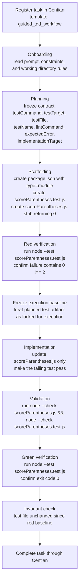

# centian-benchmarks
Raw benchmark data and reproduction assets for the governed-agent benchmark article ["Done!" — But Did Your Agent Actually Do the Work?](https://t4cceptor.github.io/centian-benchmarks/).

Links:

- [Centian repository](https://github.com/T4cceptor/centian)
- [Article in GH Pages](https://t4cceptor.github.io/centian-benchmarks/)
- [Article in Repository](./index.md)
- [Benchmark data](./benchmarks/centian_demo_v1/results)

## Benchmarks

- Guided TDD workflow: [benchmarks/centian_demo_v1](./benchmarks/centian_demo_v1)
- Context sprawl v1: [benchmarks/context_sprawl_v1](./benchmarks/context_sprawl_v1)

## Getting started

### Dependencies

- `centian` (`>=v0.4`) available on your `PATH`
  - Install with `curl -fsSL https://raw.githubusercontent.com/T4cceptor/centian/main/scripts/install.sh | bash`
- `node` (tested with `v24.2.0`) and `npx` (tested with `11.3.0`) available on your `PATH` - required to launch filesystem and shell MCP servers, and run tests
- `python3` available on your `PATH` - required for the Python-based `context_sprawl_v1` benchmark fixture
- Claude Code, Gemini CLI, or OpenAI Codex installed and authenticated - Centian launches the selected agent in headless mode through its local CLI, so the demo will fail if that agent binary is missing or it's not signed in.
- For `codex-ollama`, make sure local Ollama is running at `http://localhost:11434/v1`. Centian provides built-in `gemma4-local` and `qwen-local` Codex OSS profiles, and you can override the base Codex config with `--codex-config`.

### Display benchmark data

The repo already contains raw benchmark data from the article, including the SQLite dump at [benchmarks/centian_demo_v1/results](./benchmarks/centian_demo_v1/results). To inspect it in Centian:

```bash
centian start --config-path src/static_centian_config.json
```

That view is useful if you want the same level of detail shown in the article: per-run timelines, tool call history, and step-level verification results.

### Run benchmarks

The article benchmarks use [run-centian-demo-v1-benchmarks.sh](./run-centian-demo-v1-benchmarks.sh). With no arguments it opens a small interactive wizard where you choose the suite, one or more agent/model scenarios, repeat count, and optional config overrides:

```bash
./run-centian-demo-v1-benchmarks.sh
```

For repeatable runs, use flags instead:

```bash
./run-centian-demo-v1-benchmarks.sh \
  --suite context_sprawl_v1 \
  --scenario codex-gpt-5.4 \
  --repeat 1
```

Useful discovery commands:

```bash
./run-centian-demo-v1-benchmarks.sh --list-suites
./run-centian-demo-v1-benchmarks.sh --list-scenarios
./run-centian-demo-v1-benchmarks.sh --help
```

Run a single benchmark directly:

```bash
centian benchmark run \
  --suite ./benchmarks/centian_demo_v1 \
  --agent gemini \
  --model gemini-3-flash-preview \
  --repeat 1
```

- `--agent`: `gemini`, `codex`, `claude`, or `codex-ollama`
- `--model`: use a valid model/profile for the selected agent, for example `haiku`, `sonnet`, `opus`, `gpt-5.4`, `gpt-5.4-mini`, `gemini-3-flash-preview`, or a local Ollama-backed profile such as `qwen35-local`

## Ideal agent flow

This benchmark uses the `guided_tdd_workflow` task template. The ideal run is:



Practical reading of the flow:

- Plan first, then execute against that frozen contract.
- Establish the red baseline before implementing the solution.
- During implementation, change the production file, not the test, after the failing test has been confirmed.
- Use only Centian-exposed tools and Node built-ins from the project root.

## Helpful info for benchmark runs

`run-centian-demo-v1-benchmarks.sh` now has two modes:

- **wizard mode** when launched with no arguments
- **flag mode** for explicit, repeatable runs

Suites and scenario presets live near the top of the script. To add a future agent/model preset, add one row across the scenario arrays there; no more commenting runner calls in and out.

Useful script inputs:

| Variable | Default | Effect |
| --- | --- | --- |
| `CENTIAN_BIN` | `$(command -v centian)` | Path to the `centian` executable. The script exits if this path is missing or not executable. |
| `SUITE_PATH` | suite-selected default | Benchmark suite passed to `--suite`. The script exits if the directory does not exist. |
| `REPEAT` | `10` | Repeat count passed to `--repeat`. |
| `TIMEOUT` | `30m` | Timeout passed to `--timeout`. |
| `CODEX_CONFIG_PATH` | scenario-specific default | Optional global override for `codex` and `codex-ollama` scenarios. |
| `CENTIAN_CONFIG_PATH` | suite-selected default | Optional global override for the Centian config. |
| `TEMPLATE_DIRS` | `current=task-templates` | Comma-separated list of template-dir values. Each non-empty entry becomes its own `--template-dir <value>` flag. |

Good to know:

- `--suite` accepts either a known suite id (`centian_demo_v1`, `context_sprawl_v1`) or a direct suite path.
- Repeat `--scenario` to run multiple presets, or use `--all-scenarios`.
- `--dry-run` prints the exact `centian benchmark run` commands without launching them.
- Codex and Codex-Ollama presets now carry separate default config files in the scenario catalog.
- There is no script-level reasoning-effort option. For Codex runs, use a preconfigured `CODEX_CONFIG_PATH` if you need that behavior.
- The benchmark from the article is a governed TDD workflow. Success is not just “tests pass”; the agent also has to follow the workflow contract enforced by Centian.
- Local Ollama-backed runs are practical for reproduction, but based on the article results they are much slower than API-backed runs on consumer hardware.

Example: override suite/config/template settings

```bash
./run-centian-demo-v1-benchmarks.sh \
  --suite centian_demo_v1 \
  --scenario codex-ollama-qwen35 \
  --repeat 1 \
  --template-dirs "current=./task-templates/"
```

Equivalent direct `centian benchmark run` shape for a single Codex Ollama scenario:

```bash
centian benchmark run \
  --suite ./benchmarks/centian_demo_v1 \
  --agent codex-ollama \
  --profile qwen35-local \
  --repeat 1 \
  --timeout 30m \
  --template-dir "current=task-templates/" \
  --codex-config benchmarks/centian_demo_v1/agent_configs/codex_ollama_config.toml \
  --centian-config benchmarks/centian_demo_v1/centian_config.json
```
